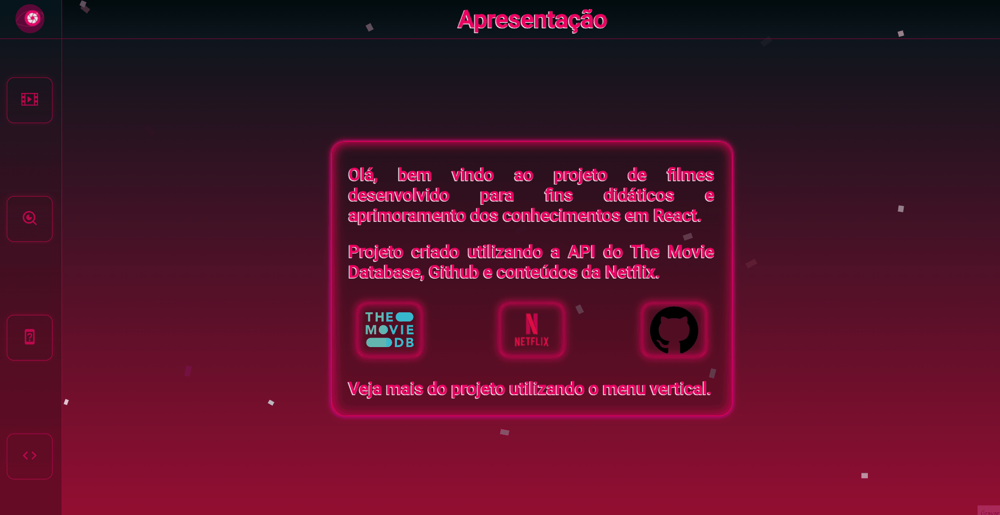

# MoviesApp 💭

Repositório do projeto **MoviesApp** desenvolvido com fins didáticos de aprimoramento dos conhecimentos em React-Js

### 🎯 Menu

Clique para expandir

◽ <a href="#inicio">Início</a>  
◽ <a href="#instalacao">Acessar Projeto</a>  
◽ <a href="#acessar-projeto">Instalação</a>  
◽ <a href="#tecnologias">Tecnologias</a>  
◽ <a href="#sobre">Sobre</a>  
◽ <a href="#extras">Extras</a>  
◽ <a href="#preview">Preview</a>  
◽ <a href="#status">Status do Projeto</a>  
◽ <a href="#autor">Autor</a>  

<h3 id="preview">🎥 Preview</h3>

<h3 id="inicio">🚀 Site do projeto</h3>

[Visite o Site do Projeto MoviesApp](https://movies-app-beta-henna.vercel.app) 🎮

<h3 id="acessar-projeto">📁 Inicialização da Clonagem</h3>

◽ <a href="https://github.com/IMatheusPiresI/React-API-Filmes">Acessar</a>🔗 o código fonte pelo GitHub.  
◽ Clonar o repositório ultilizando Git Bash + o comando:

       $ git clone https://github.com/IMatheusPiresI/React-API-Filmes.git

◽ Acessar a pasta react-filmes e executar o comando  

        $ npm install

◽ Após a instalação das dependências, rodar o comando   

        $ npm start

<h3 id="instalacao">🛠️ Acessar Projeto</h3>

Ao clicar em <a href="https://movies-app-beta-henna.vercel.app" target="_blank">Movies App</a>🔗 o site irá abrir para que possa utilizá-lo. Ele salvará as informações de filmes sorteados e pesquisados caso feche e página e abra novamente, todos esse dados são salvos e recuperados via localStorage;

<h3 id="tecnologias">⚙️ Tecnologias Utilizadas</h3>

  
  
  
  

<h3 id="sobre">📍 Sobre</h3>

✅ Desenvolvido com React, Styled-Components, Context API, React Hooks.  
✅ O projeto é uma SPA, trocando apenas o conteúdo dentro da página home. 
✅ Dados de busca do usuário salvados em localStorage para que as pesquisas e sorteios continuem após fechar e abrir o navegador  
✅ O algorítimo faz a checagem das ultímas buscas e requisições a API e a retorna ao abrir a página novamente.  
✅ Desenvolvido o catálogo, campo de busca e sorteio de filmes com base na API do TMDB (The Movie Database). 
✅ Sessão de Desenvolvedor criada utilizando a API do Github, em formato de clone da aba Repositórios. 
✅ Toda criação criada utilizando Styled-Components 
✅ Animações e efeitos criados utilizando o SetTimeout() para sincronizar a apresentação.   

<h3 id="extras">📢 Extras</h3>

✅ Criei uma unica página para a plicação, onde mostrava apenas o menu vertical.  
✅ Todo o conteúdo são páginas acessadas através do roteamento do React-Router-Dom.  
✅ Trabalhei com diversas requisições a API para criar as Sessões e funcionalidades.  
✅ Projeto responsivo.  

<h3 id="status">📌 Status do projeto</h3>

Finalizado e recebendo feedbacks. ✔

<h3 id="autor">✒️ Autor</h3>

[Clique aqui](https://matheuspires.vercel.app)🔗 e acesse meu portfólio! 💼 (em construção...)  
Desenvolvido com ❤️ por **Bruno Seghese** © Alguns direitos reservados.

  
